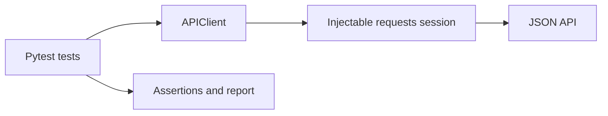

# Architecture


```mermaid
flowchart LR
    T[Pytest tests] --> C[APIClient]
    C --> S[Injectable requests session]
    S --> A[JSON API]
    T --> R[Assertions and report]
```

## Sample result

```text
tests/test_api_client.py ..                                              [100%]
2 passed in 0.12s
```
